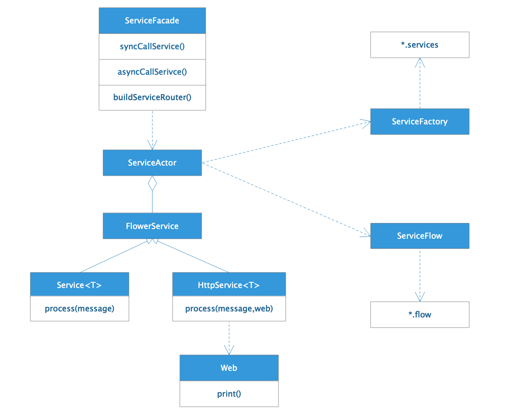
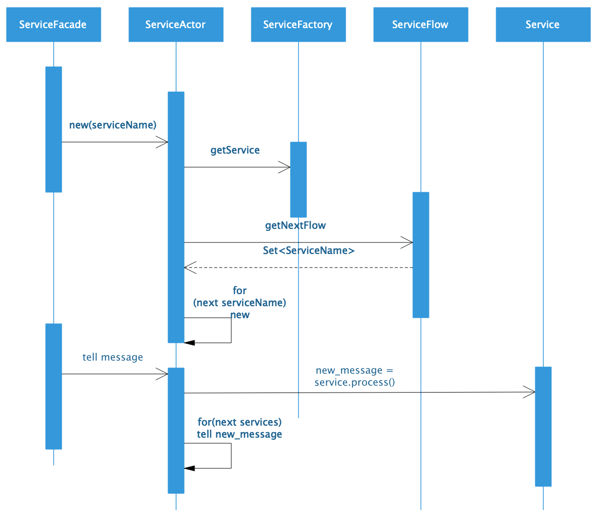
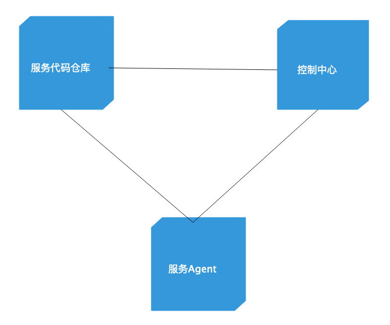
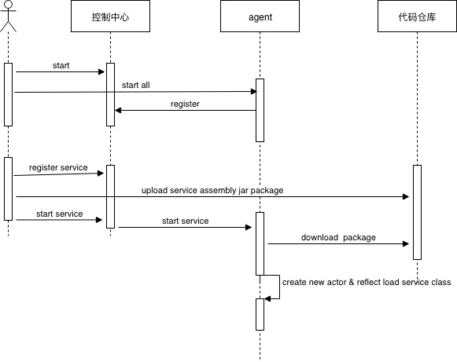

# Flower框架设计

了解关于Flower的内部设计，有助于你更好地利用Flower开发一个反应式系统。

## Flower core模块（进程内流式微服务框架）设计
Flower基于Akka的Actor进行开发，将Service封装到Actor里面，Actor收到的消息作为参数传入Service进行调用，Service的输出发送给后续Actor作为Service的输入。

### Flower核心类

* 用户开发的Service实现Service或者HttpService接口
* ServiceFactory负责用户以及框架内置的service实例管理（加载*.services文件）
* ServiceFlow负责流程管理（加载*.flow文件）
* ServiceActor将Service封装到Actor

### Flower初始化及调用时序

服务流程初始化
* 开发者通过ServiceFacade调用已经定义好的服务流程
* ServiceFacade根据传入的flow名和service名，创建第一个ServiceActor
* ServiceActor通过ServiceFactory装载Service实例，并通过ServiceFlow获得配置在流程中当前Service的后续Service（可能有多个）
* 递归创建后续Service的ServiceActor，并记录后续ServiceActor的ActorRef

消息流处理

* 调用者发送给ServiceFacade的消息，将被flow流程中的第一个ServiceActor处理
* ServiceActor调用对应的Service实例
* ServiceActor将Service实例的返回值作为消息发送给流程定义的后续ServiceActor

Flower的核心设计不过如此。但是由此延伸出来的应用方法和设计模式却和Akka有了极大的不同。

## 分布式流式微服务框架设计

传统的分布式微服务框架通过远程调用的方式实现服务的解耦与分布式部署，使得系统开发、维护、服务复用、集群部署更加方便灵活，但是这种微服务依然许多不足之处

* 具有较高的耦合性，服务之间需要在代码层面依赖调用，如果想要增加新的依赖关系，必须修改代码，修改代码是一切混乱的起源
* 服务之间同步阻塞调用，在被依赖的服务调用返回之前，当前服务必须阻塞等待，如果调用了几个服务，后面的服务必须串行等待前面的服务完成才能开始调用
* 服务的粒度不好控制，微服务如何设计没有统一的指导思想，不同系统的微服务设计千差万别，不成熟的团队因为使用微服务架构而更加混乱

流式微服务框架Flower致力于构建一种新的微服务架构体系，使用流式计算的架构思想，以一种更加轻量、更易于设计开发、消息驱动、弱依赖，异步并发的技术特点开发实现微服务系统

* 服务之间消息驱动，不需要直接依赖，没有代码耦合
* 服务之间异步调用，前面的服务完成后，发送消息后不用管，后面的服务异步处理消息
* 服务的粒度天然控制在消息的层面，每个服务只处理一个消息，而消息对于通常的web开发是天然的，一个请求就是一个消息，一个订单就是一个消息，一个用户也是一个消息，而消息就是模型，所以只要做好领域模型设计，无需用模型再去驱动设计，只需要让模型，也就是消息流动起来就可以了，模型流动到不同的服务，被不断计算、填充完善，最后完成处理就可以了，是真正的面向模型设计。
 

### 架构
#### 部署模型

Flower将整个应用系统集群统一管理控制，控制中心控制管理集群的所有资源

Agent部署在集群每一台服务器上，负责加载服务实例，并向控制中心汇报状态

代码仓库负责管理服务的java程序包，程序包用assembly打包

控制中心和Agent基于Akka开发，每个服务包装一个actor里面，actor之间负责消息的通信

 

#### 集群启动与服务部署时序模型

### 注册服务数据结构
1. 服务名：字符串，全局唯一
2. 服务路径名：class全路径名，全局唯一
3. 服务jar包名：服务所在的jar文件名，全局唯一
4. 所有者、使用者：权限控制
5. agent列表：服务需要在哪些agent启动的列表，可动态添加
6. 服务编排与消息通信

### 服务之间的依赖关系在控制中心编排
1. 服务编排时，只需要编排每个服务的后续服务，1:0..n
2. 从整个系统看，所有服务构成一个有向无环图DAG
1. 服务自身不负责消息通信，消息通信由akka的actor完成
1. 每个服务只处理一种消息
1. //TODO 服务接口定义 public object process(object message)
