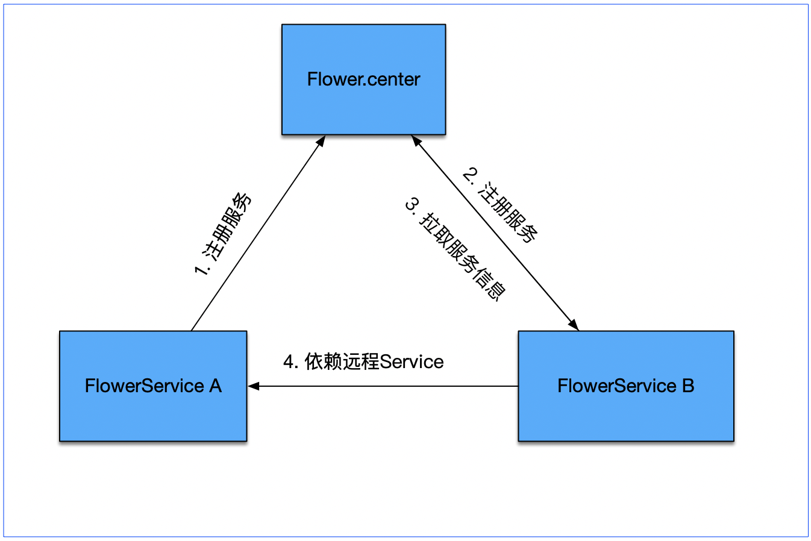

# Flower分布式开发

## Flower分布式部署架构


- Flower.center: Flower实现的注册中心，用于注册服务信息、流程信息
- Flower容器： 业务开发的代码部署到Flower服务容器中启动
- Flower网关： 服务流程编排，流程入口程序

## 开发流程
一. 启动Flower.center注册中心
二. 开发Flower Service，启动业务服务Flower容器，自动向注册中心注册服务
三. 开发Flower web网关，启动Flower网关服务，编排流程

### 一. 注册中心
Flower.center基于spring-boot开发，通过打包成fat-jar后通过命令行启动即可。

Flower注册中心启动入口`/flower.center/src/main/java/com/ly/train/flower/center/CenterApplication.java`
Flower注册中心启动命令`java -jar flower.center-0.1.2.jar`

### 二. 启动业务Flower容器
Flower部署支持Flower容器和Spring容器，下面的例子基于spring-boot演示
#### 2.1 创建配置文件flower.yml
``` 
name: "LocalFlower"
basePackage: com.ly.train.order.service
host: 127.0.0.1
port: 25004
registry:
   - url:  "flower://127.0.0.1:8096?application=LocalFlower"
```

#### 2.2 配置FlowerFactory

``` 
@Configuration
public class FlowerConfiguration {

  @Bean
  public FlowerFactory flowerFactory() {
    FlowerFactory flowerFactory = new SpringFlowerFactory();
    flowerFactory.start();
    return flowerFactory;
  }
}

```

#### 2.3 开发flower服务
``` 
@FlowerService
public class CreateOrderService implements Service<Order, Boolean> {
  private static final Logger logger = LoggerFactory.getLogger(CreateOrderService.class);

  @Override
  public Boolean process(Order message, ServiceContext context) throws Throwable {
    try {
      logger.info("创建订单 : {}", message);
    } catch (Exception e) {
      logger.error("", e);
      return Boolean.FALSE;
    }
    return Boolean.TRUE;
  }
}
```


#### 2.4 创建启动类
```
@SpringBootApplication
@ComponentScan("com.ly.train.order")
@FlowerComponentScan("com.ly.train.order")
@EnableAutoConfiguration
@MapperScan(basePackages = "com.ly.train.order.dao")
public class OrderPlatformApplication {

  public static void main(String[] args) {
    SpringApplication.run(OrderPlatformApplication.class, args);
  }
}
```

>  运行启动类即可实现Flower服务自动注册，并对外提供服务

### 三. 启动网关服务器，编排流程

> Flower网关服务器基于spring-mvc展示，跟flower服务一样，需要提供flower.yml配置信息，并配置FlowerFactory

#### 3.1 创建flower.yml

``` 
name: "LocalFlower"
basePackage: com.ly.train.web
host: 127.0.0.1
port: 25006

registry:
   - url: "flower://127.0.0.1:8096?application=LocalFlower"
```
#### 3.2 配置FlowerFactory
``` 
@Configuration
public class FlowerConfiguration {

  @Bean
  public FlowerFactory flowerFactory() {
    FlowerFactory flowerFactory = new SpringFlowerFactory("flower.yml");// 为了显示更多使用方式，这里指定配置文件路径
    flowerFactory.start();
    return flowerFactory;
  }
}
```

#### 3.3 开发Flower服务
``` 
@FlowerService(type = FlowerType.AGGREGATE)// 聚合服务类型
public class EndService extends AbstractService<List<Object>, Object> implements Flush, HttpComplete, Complete {
  private Logger logger = LoggerFactory.getLogger(EndService.class);

  @Override
  public Object doProcess(List<Object> message, ServiceContext context) throws Throwable {
    Response<List<Object>> res = R.ok(message);
    String ret = JSONObject.toJSONString(res, true);
    context.getWeb().print(ret);
    logger.info("聚合服务收到消息：" + message);
    return message;
  }

  @Override
  public void onError(Throwable throwable, List<Object> param) {
    super.onError(throwable, param);
  }

}

```

#### 3.4 开发网关Controller
``` 
@RestController
@RequestMapping("/order/")
@Flower(value = "createOrderFlow", flowNumber = 8)
public class CreateOrderController extends FlowerController {

  @Autowired
  OrderNoService orderNoService;

  @RequestMapping(value = "createOrder")
  public void createOrder(OrderExt orderExt, HttpServletRequest req) throws IOException {
    orderExt.setOrderNo(orderNoService.generateOrderNo());
    orderExt.setCreateTime(new Date());
    logger.info("收到请求:{}", orderExt);
    doProcess(orderExt, req);
  }

  @Override
  public void buildFlower() {
    getServiceFlow().buildFlow(StartService.class.getSimpleName(), Arrays.asList("CreateOrderService", "CreateOrderExtService"));
    getServiceFlow().buildFlow(Arrays.asList("CreateOrderService", "CreateOrderExtService"), "EndService");
    getServiceFlow().build();//流程创建完成会自动注册流程信息到注册中心
  }

}
```
> 集成Flower提供的基类FlowerController，使用方可以使用SpringMVC提供的注解，最大程度上保留SpringMVC的功能，学习成本几乎为零，里面封装了一些细节，让使用更关注业务开发。如果熟悉Flower的使用方式，使用方也可以完全自行扩展。

#### 3.5 启动类
``` 
@SpringBootApplication
@ComponentScan("com.ly.train.web")
@FlowerComponentScan("com.ly.train.web.service")
@EnableAutoConfiguration
public class WebApplication {

  public static void main(String[] args) {
    SpringApplication.run(WebApplication.class, args);
  }
}
```


### 实例项目细节
[flower实例](https://github.com/leeyazhou/flower.showcase.git)
`https://github.com/leeyazhou/flower.showcase.git`

# More
### 核心概念
- FlowerFactory Flower框架的入口程序，同一个JVM进程中可以创建多个FlowerFactory，互相不影响，实现应用隔离。
- ServiceFactory 管理Flower框架中的服务，包括流程管理和服务管理
- FlowRouter 流程的载体，一个FlowerRouter包含一个流程相关信息
- ServiceRouter 服务的载体，一个ServiceRouter包含一个服务的相关信息

### FlowerFactory

- 方法一

使用默认的FlowerFactory
```
FlowerFactory flowerFactory = SimpleFlowerFactory.get();
flowerFactory.start();
flowerFactory.stop();
```

- 方法二

按需创建自己的FlowerFactory，配置文件路径默认读取classpath:flower.yml,配置文件内容格式为yaml风格，详情查看配置信息。

```
FlowerFactory factory = new SimpleFlowerFactory("conf/flower_25003.yml");
factory.start();
factory.stop();
```

获取FlowerFactory之后，就可以使用它提供的接口：
```
  /**
   * 获取Flower容器配置信息
   * 
   * @return {@link FlowerConfig}
   */
  FlowerConfig getFlowerConfig();

  /**
   * 获取注册中心
   * 
   * @return {@link Registry}
   */
  Set<Registry> getRegistry();

  /**
   * 异常处理器
   * 
   * @return {@link ExceptionHandler}
   */
  ExceptionHandler getExceptionHandler();

  /**
   * akka Actor 工厂
   * 
   * @return {@link ServiceActorFactory}
   */
  ServiceActorFactory getServiceActorFactory();

  /**
   * {@link Service}工厂
   * 
   * @return {@link ServiceFactory}
   */
  ServiceFactory getServiceFactory();

  ServiceFacade getServiceFacade(); 
```

### FlowRouter流程路由器，创建流程之后，通过FlowerFactory可以创建出对应的路由器，之后便可以进行服务的调用了。
``` 
FlowRouter flowRouter = factory.getServiceFacade().buildFlowRouter("flowerSample", 2 << 6);
flowRouter.syncCallService(message);
flowRouter.asyncCallService(message, ctx);
```

## 分布式

### Flower.yml配置信息
```
name: "LocalFlower"
host: "127.0.0.1"
port: 25003
# 注册中心地址
registry:
  - url: 
      - "flower://127.0.0.1:8096"
  - url:
     - "flower://127.0.0.1:8096"
basePackage: com.ly.train.flower
```

  - name 服务名称
  - host 服务的地址
  - port 服务对外暴露的端口，也是当前Flower监听的段端口
  - registry 注册中心，对于有多个注册中心的服务，需要配置多个地址
  - basePackage 服务扫描的路径，扫描到对应的FlowerService之后会自动注册

1. Flower容器启动后，会把本地的服务元数据注册到注册中心，便可以为其他应用提供服务；流程编排的过程中，会优先使用本地容器中包含的容器，如果在本地找不到对应的服务信息，会从注册中心拉取服务信息，并创建RemoteActor备用。

2. 流程创建完毕，会把流程配置信息上传到注册中心。如果流程中涉及到本地Service和远程Service进行混排时，那么远程Service执行完毕后，可能需要把消息回传到本地Service中，这时需要从注册中心拉取Flow的配置信息，然后才能获取到当前服务的下一个Service的地址。

## 流程图
