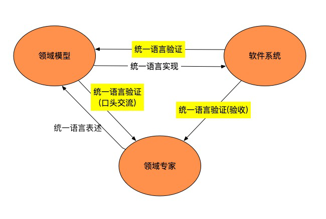
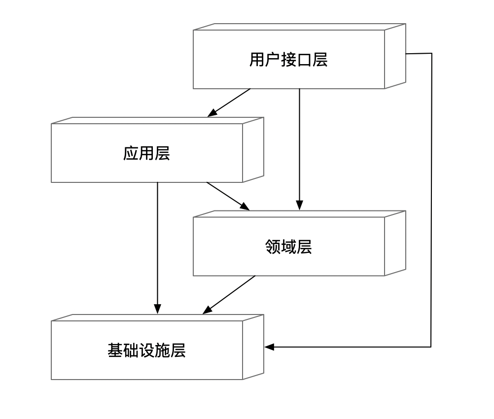
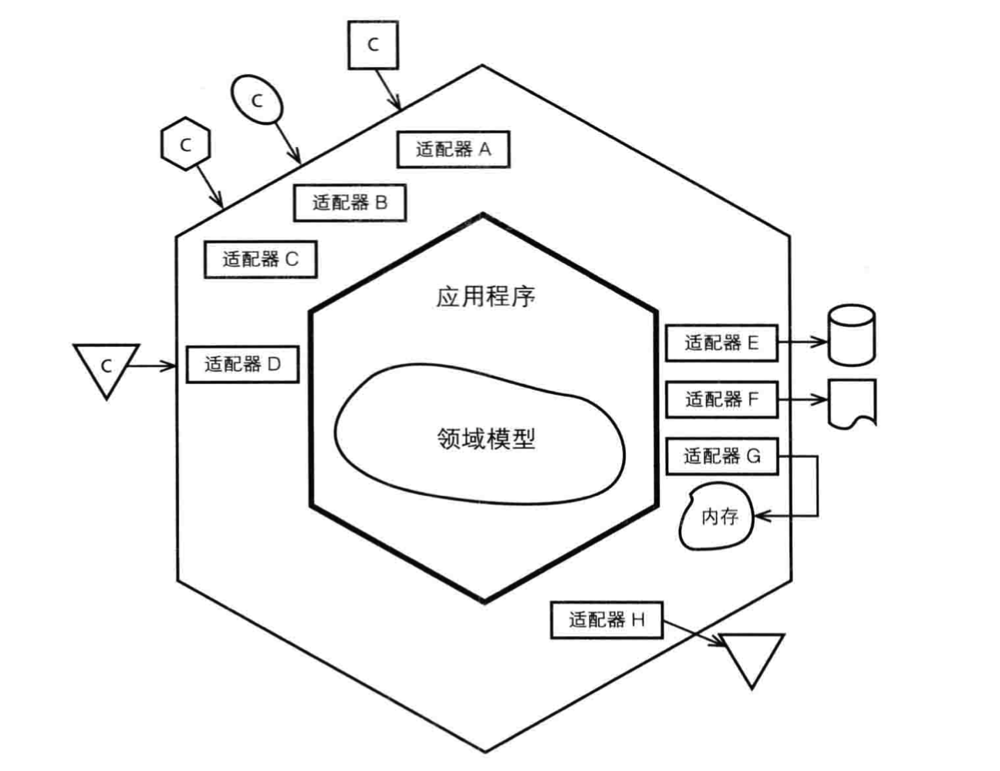
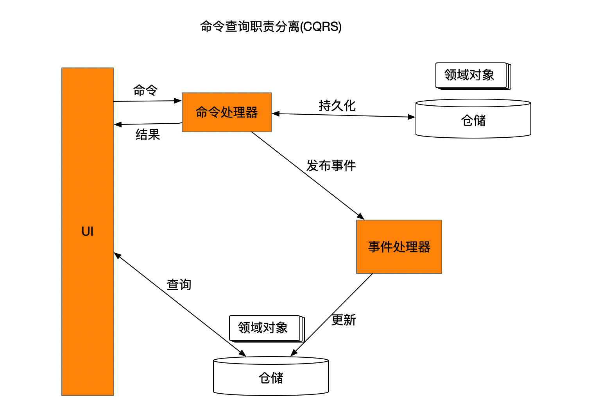
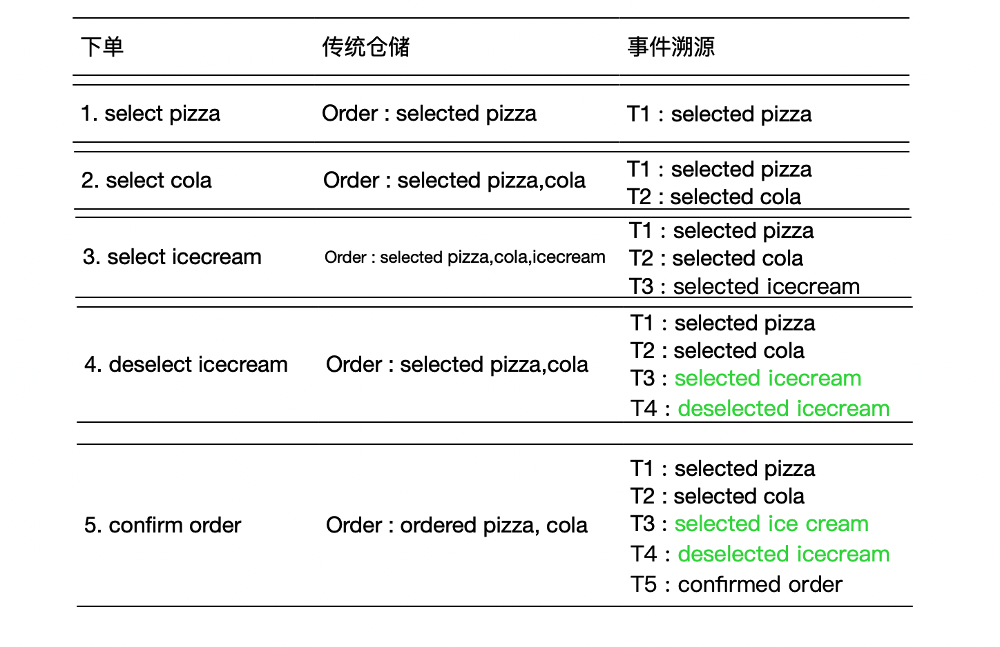
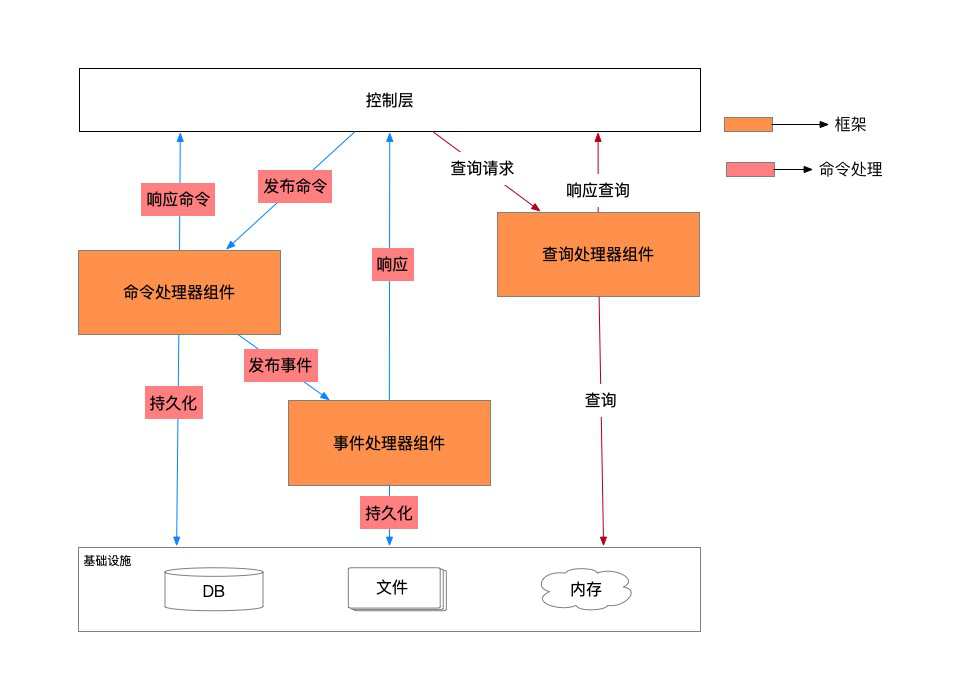

# DDD

## 1. 领域驱动设计优势

- 领域专家和开发人员共同工作，这样软件可以准确表达业务规则，就像是领域专家开发出来的一样
- 帮助业务人员自我提高
- 知识集中，确保软件知识并不只是掌握在少数人手中
- 领域专家、开发者和软件间不需要“翻译”，彼此使用通用语言交流
- 设计就是代码，代码就是设计
- DDD同时提供战略设计和战术设计。战略设计帮助理解必要的投入、团队人员构成；战术设计帮助创建DDD中的各个组件。

## 2. 通用语言(Ubiquitous Language)

领域模型和软件设计是紧密联系在一起的，软件系统的各个方面的设计都要忠实的反映领域模型，以便明确二者的对应关系。而且需要经常反复检查修改模型，以便更优雅的实现模型。
那么，领域专家、设计人员和开发人员就要有一套交流的专业术语，可以称之为Ubiquitous Language



## 3. 领域驱动设计概念

- 实体(Entity/Reference Object）
- 值对象(Value object)
- 聚合(Aggregate)和聚合根(Aggregate Root)
- 领域服务(Domain Service)
- 领域事件(Domain Event)
- 仓储(Repository)

### 实体(Entity/Reference Object)

领域中具有生命周期的对象，通常会经历创建、更新和销毁的过程。它的显著特点是拥有一个全局唯一标识符，而且唯一标识符是区分两个实体是否相等的唯一条件。

### 值对象(Value object)

领域中当只关心领域模型的属性时，应把它归类为值对象。 而且值对象应该是不可变的，和实体对比来看，值对象不需要分配唯一标识符。两个对象只要内部属性都相等，就可以认为是同一个对象。

### 聚合聚合根(Aggregate)和聚合根(Aggregate Root)

- 聚合定义了一组具有内聚关系的相关对象的集合，是一个修改数据的单元，通过聚合定义出对象间的关系和边界。
- 如果一个聚合只包含一个实体，那么这个实体可以认为是一个聚合根。

### 领域服务(Domain Service)

- 领域设计中，有些重要的操作不适合归类到Entity或Value Object的，可以设计到Service中，本质上是一些活动或者行为动作。
- 软件设计中，Service可以划分为三种类型：应用层服务、领域层服务和基础设施服务

### 领域事件(Domain Event)

聚合对象接收命令(Command)请求和查询(Query)请求时，可能需要生成领域事件对象给领域对象。在CQRS模式的应用中，领域事件通常是由命令请求产生的。

### 仓储(Repository)

实体对象需要存储，可以存储在内存(In Memory)或者磁盘(Database)上，在需要实体对象时再从仓储中重构出实体对象。在实践中，数据库存储是仓储的一种实现方式。

## 4. 领域驱动模式

- 分层架构(Layers Architecture)
- 六边形理论(Hexagonal Architecture)
- 洋葱架构/简洁架构(Onion Architecture/The clean Architecture)
- 命令查询职责分离(Command-Query Responsibility Segregation)
- 事件溯源(Event Source)

### 分层架构(Layers Architecture)



### 六边形架构/端口适配器架构(Hexagonal Architecture)



### 洋葱架构/简洁架构(Onion Architecture/The clean Architecture)


### 命令查询职责分离(Command-Query Responsibility Segregation)



### 事件溯源(Event Source)

事件溯源是一种数据存储的模式，区别于传统仓储存储实体对象的当前状态，事件溯源则存储了影响实体对象变化的所有事件，通过事件历史回溯实体的当前状态。



## 5. Flower Domain Driven Design

### Flower DDD的设计思路
- Flower基于akka，是一个反应式微服务框架，原生支持消息驱动模式。
- Actor模型是消息驱动、非阻塞的，优雅解决多线程难题，提高系统吞吐量
- 定义CommandHandler和EventHandler，处理Command和Query
- 编排CommandGateway流程和QueryGateway流程，代理Command和Query的操作入口
- 基于Flower异步特性，异步响应

Flower CQRS架构图


### Command

- CommandGateway
- CommandHandler
- EventHandler

#### CommandGateway

```java
  @Autowired
  CommandGateway commandGateway;

  @RequestMapping("/create")
  public void createFoodCart() {
    // ui create food cart
    // publish an commannd : CreateOrderCommand
    commandGateway.send(new CreateOrderCommand(index.incrementAndGet(), "foodcart"));
  }
```

#### CommandHandler

```java
  @CommandHandler
  public void command(CreateOrderCommand command, ServiceContext context) {
    logger.info("创建订单命令：{}", command);
    AggregateLifecycle.apply(new CreateOrderEvent(command.getId(), command.getName()));
  }
```

#### EventHandler

```java
  @EventHandler
  public void on(CreateOrderEvent event, ServiceContext context) throws IOException {
    logger.info("处理订单事件：{}", event);
    context.getWeb().printJSON(JSON.toJSONString(event));
    // dao
  }
```

### Query

### QueryGateway

```java
  @Autowired
  QueryGateway queryGateway;

  @RequestMapping("{orderId}")
  public void queryFoodcart(@PathVariable Long orderId) {
	  queryGateway.query(new SelectOrderCommand(orderId));
  }
```

### QueryHandler 

```java
  @CommandHandler
  public void command(SelectOrderCommand command, ServiceContext context) {
    logger.info("选择订单命令：{}", command);
    AggregateLifecycle.apply(new SelectOrderEvent(command.getId()));
  }
```

### EventHandler

```java
  @EventHandler
  public void on(SelectOrderEvent event, ServiceContext context) {
    logger.info("选择订单事件：{}", event);
    // do something
  }
```

### Flower请求响应

ServiceContext中持有请求上下文对象HttpServletRequest，通过ServiceContext可以对客户端响应数据。

```java
  @EventHandler
  public void on(CreateOrderEvent event, ServiceContext context) throws IOException {
    logger.info("处理订单事件：{}", event);
    context.getWeb().printJSON(JSON.toJSONString(event));
    // dao
  }
```

### 集成spring-boot

```java
@SpringBootApplication
@FlowerComponentScan("com.ly.train.flower.ddd")
@EnableTransactionManagement
public class DDDApplication {
    public static void main(String[] args) {
         SpringApplication.run(DDDApplication.class, args);
     }
}
```
